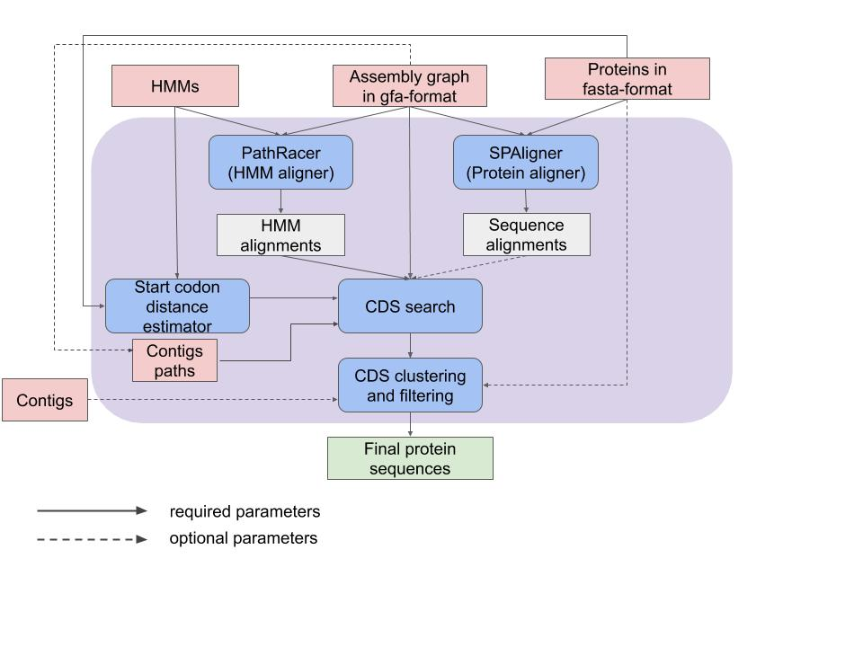

# ORFs search in assembly graphs

Pipeline for generating potential gene sequences, ORFs (Open Reading Frames), from assembly graphs.
Our pipeline incorporates the power of two graph alignment tools (PathRacer and SPAligner) and uses their output as initial anchors to search for full gene sequences in assembly graphs.

## Installation

The main pipeline is written in Python3 and uses several libraries described below.
Used libraries and tools: 
- Python3:
    - [biopython](https://biopython.org/wiki/Download)
    - [pyyaml](https://pyyaml.org/wiki/PyYAMLDocumentation)
    - [Edlib](https://pypi.org/project/edlib/)
    - [HMMer](http://hmmer.org)
    - [joblib](https://joblib.readthedocs.io/en/latest/installing.html)
- [Mummer4](https://github.com/mummer4/mummer/releases)
- [PathRacer](http://cab.spbu.ru/software/pathracer/)
- [SPAligner](http://cab.spbu.ru/software/spaligner/)

Paths to local versions of HMMer and Mummer4 can be set in config.yaml (or leave it empty if they were installed globaly).
Execution files of PathRacer and SPAligner must be in `aligners/` folder.

## Running

Search for potential Cry and Vip proteins in assembly graph of *Brevibacillus laterosporus* strain MG64(SRR8316749):
    
    run_ORFs_search.py  -m test_data/pfamA.of.interest_pfam.hmm  # list of HMMs in HMMer format that represent domains for PathRacer input
                        -s test_data/toxins.fasta                # list of known Cry and Vip sequences (either -m or -s has to be set)
                        -g test_data/graph.gfa                   # path to assembly graph
                        -k 55                                    # assembly graph k-mer size
                        -c test_data/contigs.fasta               # contig sequences (optional)
                        -t 16                                    # number of threads to use
                        -o test                                  # output folder

Try `run_ORFs_search.py -h` for more options. Test data for this example can be downloaded from [figshare](https://figshare.com/s/28de3bac33d6f0156998).

## Output

Results can be found in user defined folder `-o test`:
    
    test/pfamA.of.interest_pfam/            PathRacer run results
    test/toxins/                            SPAligner run results
    test/orfs_raw.fasta                     Full list of ORFs that were found in assembly graph
    test/orfs_total.fasta                   List of ORFs after initial filtering
    test/orfs_graphonly.fasta               List of ORFs that can be found only in graph (not in contigs)
    test/orfs_novel.fasta                   List of novel ORFs (not presented in Bacillus thuringiensis Toxin Nomenclature)
    test/orfs_final_clustered.fasta         List of ORFs clustered with 90% identity
    test/orfs_final_most_reliable.fasta     List of representatives for each cluster (usually contains 2-3 sequences per cluster)

## Main algorithm

1. **Aligning insecticide proteins/HMMs to the assembly graph.** Our method uses SPAligner (Dvorkina et al, 2019) to align insecticide proteins to the assembly graph and retains all alignments with length exceeding 80% of the protein length. It also uses PathRacer (Shlemov and Korobeynikov, 2019) to align HMMs to the assembly graph and retains all alignments with e-value below 10-9 and length exceeding 90% of the HMM length. 
2. **Start and stop codon search.** For each alignment, our method finds all putative start and stop codons in the assembly graph using the Breadth-First-Search (BFS).  The BFS search is performed on the graph where each vertex represents a pair: a position in the assembly graph and a frameshift string of length 0, 1, or 2, that stores the prefix of the current codon triplet. Information about sequences with start codons that are positioned after a stop codon or the Shine-Dalgarno sequence in the graph will be reflected in the resulting CDS file. 
3. **CDS generation.** For each start/stop codon of the partial alignment, our method generates a set of paths that lead from a start/stop codon position to the ends of the alignment. We run the bounded exhausting search through all prefixes/suffixes (limited to generating at most 1000 paths). For each pair of start and stop codon, all prefixes and suffixes are concatenated with the partial alignment and the resulting path (in nucleotides) is converted to the corresponding protein sequence. Finally, duplicate protein sequences are filtered out and all sequences that are found in a single contig (optional) and all sequences that represent known genes are marked as “trivial”.
4. **CDS filtering and clustering.** All paths conflicting with some contig-paths are filtered out from the list of putative IPG paths. Afterwards, IPGs clustering and clusters filtering are performed. 

## Contacts

For any questions or suggestions please do not hesitate to contact Tatiana Dvorkina <tanunia@gmail.com>.